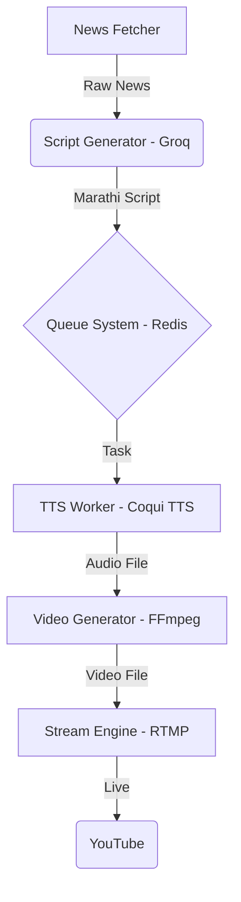

# VARTAPRAVAH Autonomous News Pipeline

## Architecture Flow


## Setup Instructions

### 1. Prerequisites
- Python 3.10+
- Redis Server
- FFmpeg (with HarfBuzz and rtmp support)
- Groq API Key
- Coqui TTS (XTTS v2)

### 2. Environment Configuration
Create a `.env` file with:
```env
GROQ_API_KEY=your_key
NEWS_API_KEY=your_key
YOUTUBE_STREAM_KEY=5w92-9u7p-ucjh-b1bx-bszv
REDIS_URL=redis://localhost:6379/0
```

### 3. Components
- **Fetcher**: Fetches news and generates Marathi scripts.
- **Worker**: Processes the queue, generates audio and video.
- **Streamer**: Manages the persistent RTMP stream.
